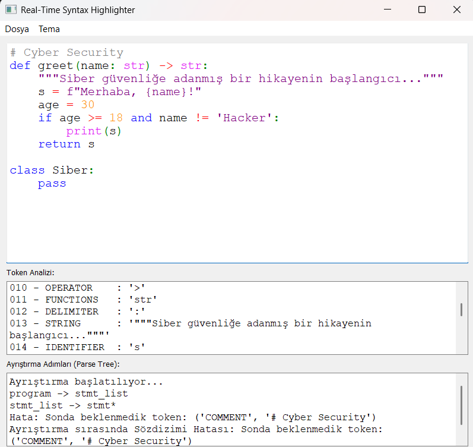

# 🖍️ Real-Time Grammar-Based Syntax Highlighter

> 🎯 A professional Python + PyQt5 application that provides real-time, grammar-aware syntax highlighting using Pygments.  
> 📄 [Medium Article (EN/TR)](https://medium.com/@mehmet-ozay/ger%C3%A7ek-zamanl%C4%B1-syntax-highlighter-python-ve-pyqt5-ile-modern-kod-vurgulama-6b93d313b652) · 🎥 [Demo Video](https://www.youtube.com/watch?v=ZCoWH5PO7TI) · 📘 [Technical Docs](https://github.com/ozay-mehmet/Syntax-Highlighter/blob/main/docs/final_documentation.md)

---

## 🌐 Overview

A modern, feature-rich code editor built in **Python** using **PyQt5**, **QSyntaxHighlighter**, and **Pygments**. This tool offers **grammar-aware token parsing**, **real-time syntax highlighting**, and **multi-theme support**, designed to improve your code editing experience with style and intelligence.

---

## ✨ Features

- ✅ Real-time syntax highlighting
- 🧠 Grammar-based lexical parsing (via Pygments)
- 🌓 Light/Dark theme toggle
- 📂 File open/save support
- 🧑‍💻 Native Python syntax highlighting (more languages soon)
- 🪄 Modern and responsive PyQt5 interface

---

## 🖼️ Screenshots

| ☀️ Light Theme                               | 🌙 Dark Theme                                |
|---------------------------------------------|----------------------------------------------|
|                   |                     |

---

## 🛠️ Technologies Used

| Technology         | Role                                     |
|--------------------|------------------------------------------|
| Python 3.12.4      | Main programming language                |
| PyQt5              | GUI framework                            |
| QSyntaxHighlighter | Core syntax coloring engine              |
| Pygments           | Grammar-aware tokenization and parsing   |
| Git & GitHub       | Version control                          |

---

## 📄 Documentation

| Type                | Link                                            |
|---------------------|-------------------------------------------------|
| 📘 Technical Docs   | [View Docs](https://github.com/ozay-mehmet/Syntax-Highlighter/blob/main/docs/final_documentation.md)         |
| ✍️ Medium Article   | [Read Article](https://medium.com/@mehmet-ozay/ger%C3%A7ek-zamanl%C4%B1-syntax-highlighter-python-ve-pyqt5-ile-modern-kod-vurgulama-6b93d313b652) |
| 🎥 Demo Video       | [Watch Demo](https://www.youtube.com/watch?v=ZCoWH5PO7TI)     |

---

## 🚀 Roadmap

- 💾 Auto-save & crash recovery
- 🔍 Find and Replace feature
- ⚡ Performance optimization for large files
- 🎨 Customizable theme editor

---

## 🤝 Contributing

We welcome all contributions!

- 🐞 Report bugs via [Issues](https://github.com/ozay-mehmet/Syntax-Highlighter/issues)
- 💡 Suggest features and improvements
- 🔧 Submit a [Pull Request](https://github.com/ozay-mehmet/Syntax-Highlighter/pulls)

---

## 📬 Contact

For collaboration or questions:  
🔗 [LinkedIn – Mehmet Özay](https://www.linkedin.com/in/mehmet-ozay/)

---

## 🇹🇷 Türkçe Versiyon – Gerçek Zamanlı Gramer Tabanlı Sözdizimi Vurgulayıcı

---

## 🌐 Genel Bakış

Bu uygulama, **Python**, **PyQt5**, ve **Pygments** kullanılarak geliştirilmiş modern bir **kod editörüdür**. Gerçek zamanlı sözdizimi vurgulama, gramer tabanlı token analizleri ve tema desteği gibi birçok gelişmiş özellik sunar.

---

## ✨ Özellikler

- ✅ Gerçek zamanlı sözdizimi vurgulama
- 🧠 Pygments ile gramer tabanlı ayrıştırma
- 🌓 Açık / Karanlık tema desteği
- 📂 Dosya aç/kaydet özellikleri
- 🧑‍💻 Python dili desteği (ileride diğer diller eklenecek)
- 🪄 Modern PyQt5 arayüzü

---

## 🖼️ Ekran Görüntüleri

| ☀️ Açık Tema                                 | 🌙 Karanlık Tema                              |
|---------------------------------------------|----------------------------------------------|
|                   |                     |

---

## 🛠️ Kullanılan Teknolojiler

| Teknoloji          | Kullanım Amacı                          |
|--------------------|------------------------------------------|
| Python 3.12.4      | Temel programlama dili                   |
| PyQt5              | Grafiksel kullanıcı arayüzü              |
| QSyntaxHighlighter | Kod renklendirme motoru                  |
| Pygments           | Token analizi ve gramer ayrıştırması     |
| Git & GitHub       | Sürüm kontrol sistemi                    |

---

## 📄 Belgeler

| Tür                 | Bağlantı                                           |
|---------------------|----------------------------------------------------|
| 📘 Teknik Dokümantasyon | [Dökümantasyonu Görüntüle](https://github.com/ozay-mehmet/Syntax-Highlighter/blob/main/docs/final_documentation.md) |
| ✍️ Medium Makalesi     | [Makaleyi Oku](https://medium.com/@mehmet-ozay/ger%C3%A7ek-zamanl%C4%B1-syntax-highlighter-python-ve-pyqt5-ile-modern-kod-vurgulama-6b93d313b652)         |
| 🎥 Demo Videosu        | [Videoyu İzle](https://www.youtube.com/watch?v=ZCoWH5PO7TI)          |

---

## 🚀 Gelecek Planları

- 💾 Otomatik kayıt ve çökme kurtarma
- 🔍 Bul/Değiştir özelliği
- ⚡ Büyük dosyalar için performans artırımı
- 🎨 Özelleştirilebilir tema düzenleyici

---

## 🤝 Katkı Sağlayın

Her türlü katkıya açığız!

- 🐞 Hata bildirin → [Issue Açın](https://github.com/ozay-mehmet/Syntax-Highlighter/issues)
- 💡 Yeni özellik önerin
- 🔧 Pull Request gönderin → [Katkıda Bulunun](https://github.com/ozay-mehmet/Syntax-Highlighter/pulls)

---

## 📬 İletişim

İş birliği ya da sorular için:  
🔗 [LinkedIn – Mehmet Özay](https://www.linkedin.com/in/mehmet-ozay/)

---

## 🏷️ Etiketler

`#python` `#pyqt5` `#syntax-highlighter` `#code-editor` `#opensource` `#realtimesyntax`

