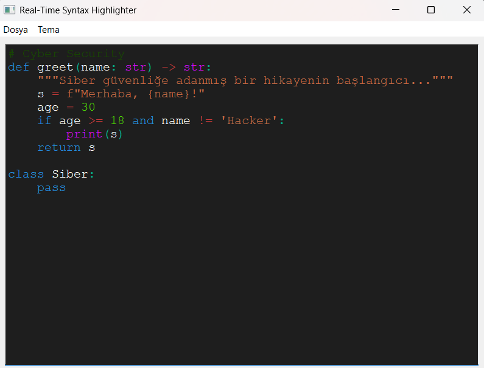

# Proje Adı: Gerçek Zamanlı Sözdizimi Vurgulayıcı ve Analiz Aracı

## 1. Giriş

Bu proje, kullanıcı tarafından girilen kodun sözdizimini gerçek zamanlı olarak analiz eden, vurgulayan ve ayrıştırma adımlarını gösteren bir masaüstü uygulamasıdır. Temel amacı, Python dillerinin yapıtaşları olan token'ların (leksik birimler) tanınması, bu token'ların belirli bir dilbilgisine göre ayrıştırılması (parsing) ve bu süreçlerin kullanıcıya anlaşılır bir şekilde sunulmasıdır. 

---

## 2. Kullanılan Teknolojiler

* **Programlama Dili:** Python 3.12.4
* **Arayüz Kütüphanesi:** PyQt5 (Qt framework'ünün Python bağlaması)
* **Temel Modüller:**

  * `re`: Düzenli ifadeler (Regular Expressions) ile token tanımlama.
  * `PyQt5.QtWidgets`: GUI bileşenleri (Pencere, metin editörü, etiketler vb.).
  * `PyQt5.QtGui`: Renk, font, metin formatlama ve `QSyntaxHighlighter` gibi GUI ile ilgili sınıflar.
  * `PyQt5.QtCore`: Sinyal/slot mekanizmaları, zamanlayıcı (`QTimer`) gibi temel Qt sınıfları.

  ---

## 3. Proje Mimarisi

Proje, temel olarak dört ana bileşenden oluşmaktadır:

1. **Lexer (Sözcüksel Analizci):** Kaynak kodu alıp token dizisine dönüştürür.
2. **Parser (Sözdizimsel Analizci):** Token dizisini alıp dilbilgisi kurallarına göre analiz eder ve bir ayrıştırma ağacı (veya adımları) oluşturur.
3. **Highlighter (Vurgulayıcı):** Token türlerine göre metin editöründeki kodu renklendirir.
4. **GUI (Grafiksel Kullanıcı Arayüzü):** Kullanıcının kod girmesini, analiz sonuçlarını görmesini ve uygulama ile etkileşimde bulunmasını sağlar.

---

## 4. Bileşenlerin Detaylı Açıklaması

### 4.1. Lexer (`src/lexer/lexer.py`)

Lexer, kaynak kod metnini anlamlı birimlere (token'lara) ayırır.

* **Token Tanımlama:** Token'lar (anahtar kelimeler, tanımlayıcılar, operatörler, sayılar, string'ler, yorumlar vb.) düzenli ifadeler (regex) kullanılarak tanımlanır.
* **Harici Token Listeleri:**
  * Anahtar kelimeler (`docs/keywords.txt`)
  * Gömülü fonksiyonlar/sabitler (`docs/functions.txt`)
  * Operatörler (`docs/operators.txt`)
  * Ayraçlar (`docs/delimiters.txt`)
    Bu dosyalar, lexer'ın tanıması gereken token setlerini dinamik olarak yüklemesini sağlar, böylece farklı veya genişletilmiş bir dil için kolayca uyarlanabilir.
* **`tokenize(code: str)` Fonksiyonu:** Verilen kodu analiz eder ve `(TOKEN_TURU, TOKEN_DEGERI)` formatında bir token listesi döndürür. Bilinmeyen karakterleri veya boşlukları atlar.

### 4.2. Parser (`src/parser/parser.py`)

Parser, lexer tarafından üretilen token dizisini alır ve önceden tanımlanmış bir dilbilgisine göre sözdizimsel yapısını kontrol eder.

* **Ayrıştırma Yöntemi:** Özyinelemeli iniş (recursive descent) ayrıştırıcı prensibine dayanır. Dilbilgisindeki her bir kural (örn: ifade, atama, if-deyimi) için bir metod bulunur.
* **Token İlerlemesi:** `peek()` ile sıradaki token'a bakar, `advance()` ile bir sonraki token'a geçer ve `match()` ile beklenen token'ı tüketir.
* **Ayrıştırma İzlemi (Parse Trace):** `_log(message: str)` metodu ile ayrıştırma sürecindeki her adımı (kural uygulamaları, token eşleşmeleri, hatalar) bir liste (`parse_trace`) içinde kaydeder. Bu izlem, GUI'de "Ayrıştırma Adımları" bölümünde gösterilir.
* **Hata Yönetimi:** Sözdizimi hataları (`SyntaxError`) fırlatır ve hatanın oluştuğu noktaya kadar olan ayrıştırma adımlarını kaydeder.
* **Desteklenen Temel Yapılar (Örnek):**
  * Atama ifadeleri (`degisken = ifade;`)
  * `if` koşul ifadeleri (`if (koşul) { ... }`)
  * `while` döngüleri (`while (koşul) { ... }`)
  * `return` ifadeleri (`return ifade;`)
  * Fonksiyon çağrıları (`fonksiyon_adi(arg1, arg2);`)
  * Basit aritmetik ve mantıksal ifadeler.

### 4.3. Highlighter (`src/highlighter/highlighter.py` ve `CustomHighlighter` in `src/gui/gui.py`)

Vurgulayıcı, kodun okunabilirliğini artırmak için token'ları türlerine göre renklendirir.

* **`TOKEN_COLORS` (`src/highlighter/highlighter.py`):** Farklı token türleri için varsayılan renkleri tanımlayan bir sözlüktür. Ancak GUI'de temalara göre renkler dinamik olarak yönetilir.
* **`CustomHighlighter(QSyntaxHighlighter)` Sınıfı (`src/gui/gui.py`):**
  * PyQt5'in `QSyntaxHighlighter` sınıfından miras alır.
  * `highlightBlock(text: str)` metodu, metin editöründeki her bir metin bloğu (genellikle satır) için çağrılır.
  * Bu metod içinde, mevcut bloktaki metin `tokenize` fonksiyonu ile token'lara ayrılır.
  * Her bir token için, aktif temadan (`self.get_token_colors()`) alınan renk kullanılarak `QTextCharFormat` oluşturulur ve `setFormat()` ile metne uygulanır.
  * `text.find(lexeme, cursor)` kullanarak aynı lexeme'in tekrar ettiği durumlarda doğru pozisyonu bulmaya çalışır.

### 4.4. GUI (`src/gui/gui.py`)

Kullanıcı arayüzü, tüm bileşenleri bir araya getirir ve kullanıcı etkileşimini yönetir.

* **Ana Pencere (`SyntaxHighlighterApp(QMainWindow)`):**
  * **Metin Editörü (`QPlainTextEdit`):** Kullanıcının kod girdiği ana alan. `CustomHighlighter` buraya bağlanır.
  * **Token Analizi Görünümü (`QPlainTextEdit`):** Lexer tarafından üretilen token'ların listesini (sıra no, tür, değer) gösterir. Salt okunurdur.
  * **Ayrıştırma Adımları Görünümü (`QPlainTextEdit`):** Parser tarafından üretilen ayrıştırma izlemini (parse trace) gösterir. Salt okunurdur.
  * **Durum Etiketi (`QLabel`):** Analiz durumu (başarılı, hata mesajı vb.) hakkında bilgi verir.
  * **Menü Çubuğu (`QMenuBar`):**
    * **Dosya Menüsü:** "Aç" seçeneği ile `.txt`, `.py` veya herhangi bir metin dosyasını editöre yükler.
    * **Tema Menüsü:** "Açık Tema" ve "Koyu Tema" seçenekleri sunar. Tema değişikliği, editörün ve analiz alanlarının arkaplan/metin renklerini ve token vurgulama renklerini günceller.
* **Temalar (`self.themes`):** "light" ve "dark" olmak üzere iki tema tanımlıdır. Her tema, arkaplan rengi, metin rengi ve her bir token türü için `QColor` nesneleri içerir.
* **Gerçek Zamanlı Analiz:**
  * Kullanıcı metin editöründe değişiklik yaptığında (`textChanged` sinyali), `QTimer` (kısa bir gecikmeyle `analysis_timer`) tetiklenir.
  * Zamanlayıcı dolduğunda `perform_syntax_check()` metodu çalışır.
  * `perform_syntax_check()`:

    1. Editördeki kodu alır.
    2. `tokenize()` ile token'ları üretir ve Token Analizi Görünümü'nü günceller.
    3. `Parser` nesnesi oluşturur, `parse()` metodunu çağırır.
    4. Parser'dan alınan ayrıştırma izlemini Ayrıştırma Adımları Görünümü'ne yazar.
    5. Durum etiketini başarı veya hata mesajıyla günceller.
    6. Hata durumlarında, hataya kadar olan token ve ayrıştırma bilgilerini göstermeye çalışır.

    ---

## 5. Çalışma Prensibi

1. Kullanıcı, ana penceredeki metin editörüne kod yazar veya bir dosyadan kod yükler.
2. Metin editöründeki her değişiklik `textChanged` sinyalini tetikler.
3. Bu sinyal, kısa bir gecikme (debounce için 300ms) ile çalışan `analysis_timer`'ı başlatır. Bu, kullanıcı yazmayı bitirene kadar sürekli analiz yapılmasını engeller.
4. Zamanlayıcı süresi dolduğunda `perform_syntax_check` metodu çağrılır:
   a.  Editördeki güncel metin alınır.
   b.  `lexer.tokenize()` fonksiyonu ile metin token'lara ayrılır. Bu token'lar formatlanarak "Token Analizi" bölümünde listelenir.
   c.  `parser.Parser(tokens)` ile bir parser nesnesi oluşturulur.
   d.  `parser.parse()` metodu çağrılarak token dizisi üzerinde sözdizimi analizi yapılır. Bu süreçte parser, `_log` metodu ile ayrıştırma adımlarını kaydeder.
   e.  Ayrıştırma adımları "Ayrıştırma Adımları" bölümünde gösterilir.
   f.  Analiz başarılı ise durum çubuğunda başarı mesajı, hata varsa hata mesajı ve türü gösterilir.
5. Eş zamanlı olarak, `CustomHighlighter` sınıfının `highlightBlock` metodu, editördeki metin değiştikçe veya yeniden çizilmesi gerektiğinde çağrılır:
   a.  İlgili metin bloğu (satır) `lexer.tokenize()` ile token'lara ayrılır.
   b.  Her token için, aktif temadan (`self.get_token_colors()`) uygun renk alınır.
   c.  `setFormat()` ile token'ın metin editöründeki görünümü renklendirilir.
6. Kullanıcı "Tema" menüsünden tema değiştirdiğinde:
   a.  `change_theme()` metodu çağrılır.
   b.  `self.current_theme` güncellenir.
   c.  `apply_theme()` metodu ile editörün, token ve ayrıştırma analiz alanlarının arkaplan ve metin renkleri güncellenir.
   d.  `self.highlighter.rehighlight()` çağrılarak editördeki metnin yeni tema renkleriyle yeniden vurgulanması sağlanır.

---

## 6. Özellikler

* **Gerçek Zamanlı Sözdizimi Vurgulama:** Kullanıcı yazdıkça kod anında renklendirilir.
* **Token Analizi Gösterimi:** Kodun ayrıştırıldığı token'ların türü ve değeri listelenir.
* **Ayrıştırma Adımları Gösterimi:** Parser'ın kodu analiz ederken izlediği adımlar (üretim kuralları, eşleşen token'lar) detaylı olarak sunulur. Bu, dilbilgisinin nasıl çalıştığını anlamak için faydalıdır.
* **Tema Desteği:** Açık ve koyu tema seçenekleri ile kullanıcı arayüzü kişiselleştirilebilir. Tema değişikliği tüm renkleri (vurgulama, arkaplan, metin) etkiler.
* **Dosya Açma:** Kullanıcılar mevcut kod dosyalarını (`.txt`, `.py` vb.) açıp analiz edebilirler.
* **Hata Bildirimi:** Sözcüksel veya sözdizimsel hatalar anında tespit edilir ve kullanıcıya bildirilir. Hata durumunda, hataya kadar olan analiz bilgileri gösterilmeye çalışılır.
* **Yapılandırılabilir Token Setleri:** Anahtar kelimeler, operatörler gibi token tanımlamaları harici `.txt` dosyalarından okunarak kolayca güncellenebilir veya farklı bir dil için uyarlanabilir.

---
